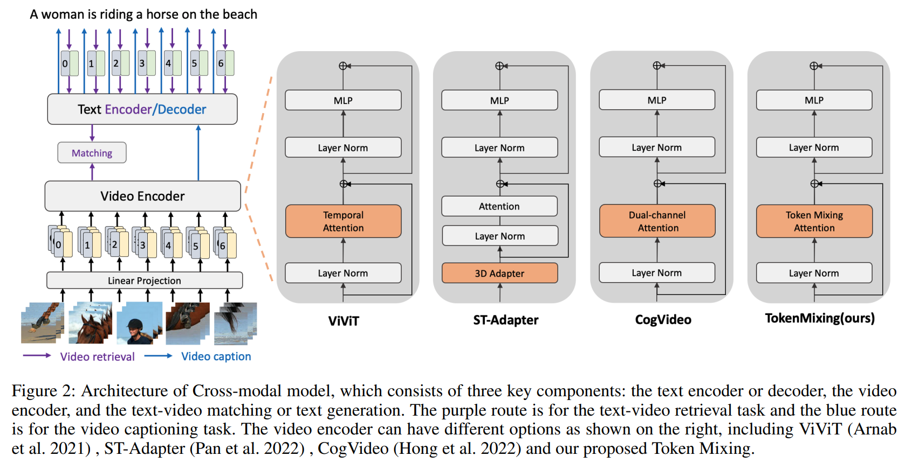

# Token Mixing: Parameter-Efficient Transfer Learning from Image-Language to Video-Language

An pytorch implementation of paper *[Token Mixing: Parameter-Efficient Transfer Learning from Image-Language to Video-Language](https://www.ruc-aim3.com/papers/token_mix.pdf)*.

We study how to transfer knowledge from image-language model to video-language tasks. And our model is based on [BLIP](https://github.com/salesforce/BLIP). We have implemented several components proposed by recent works and details are shown on models/vit.py (e.g. TokenMixBlock, STAdapter, etc).

**Suggestion**: More attempts can be done by jointly using two or more modules (e.g. temp trans + token mix). I have tried some combination and it does gain.

An overview of **different parameter-efficient tuning methods** on video-language tasks. We compare our method with four partial fine-tuning methods including Dual-channel Attention (Hong et al. 2022), BitFit (Zaken, Ravfogel, and Goldberg 2021), ST-Adapter (Pan et al. 2022) and Adapter (Houlsby et al. 2019), Temporal Fine-tuning and a fully finetuning method ViViT (Arnab et al. 2021).

### Usage

Preprocessing, get video frames using ffmpeg
<pre>change ffmpeg_frame.py, set the true video_path(input) and frames_path(output), and run it.</pre>

Edit config for specific task
<pre>change xxx.yaml, set true pre-trained model path and video path</pre>

Video-Text Captioning:
If there are some errors in evaluation, you may need <pre>sudo chmod -R 777 [path to pycocoevalcap package]</pre> 
<pre>python -m torch.distributed.run --nproc_per_node=8 train_video_caption.py --config ./configs/caption_msvd.yaml --output_dir output/caption_msvd</pre>

Text-video retrieval
<pre>python -m torch.distributed.run --nproc_per_node=8 train_video_retrieval.py --config ./configs/retrieval_msrvtt.yaml --output_dir output/retrieval_msrvtt --evaluate</pre>

Video-QA
<pre>python -m torch.distributed.run --nproc_per_node=8 train_video_vqa.py --config ./configs/videoqa_msrvtt.yaml --output_dir output/videoqa_msrvtt</pre>

### Citation
If you find this code to be useful for your research, please consider citing.
<pre>
@inproceedings{liu2022tokenmix,
      title={Token Mixing: Parameter-Efficient Transfer Learning from Image-Language to Video-Language}, 
      author={Yuqi Liu and Luhui Xu and Pengfei Xiong and Qin Jin},
      year={2023},
      booktitle={Proceedings of the 37th AAAI Conference on Artificial Intelligence (AAAI)},
}
</pre> 